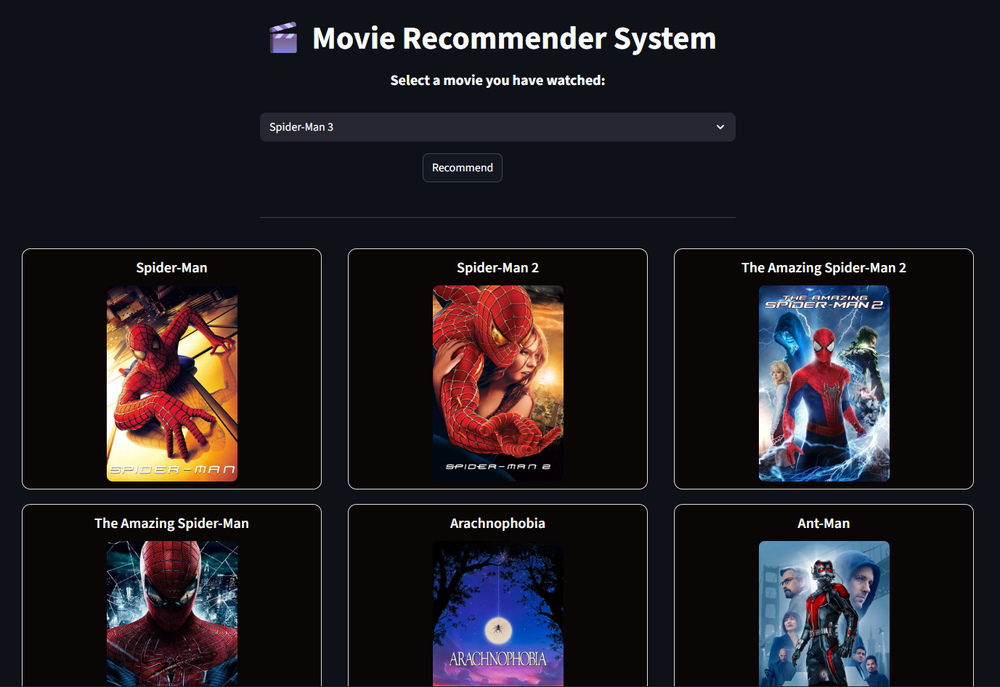

# Movie Recommender System

This project is a movie recommender system built using Python and Streamlit for the frontend. The system suggests movies similar to the one selected by the user, based on a precomputed similarity matrix.

## A Little Insightful Image




## Features
- **Movie Recommendations:** Select a movie, and the system will recommend up to 14 similar movies.
- **Streamlit Frontend:** A user-friendly interface allows for easy interaction and real-time results.
- **Recommendation Logic:** Uses cosine similarity between movie features for recommendations.

## Tech Stack and Libraries
- **Python:** Backend logic for the recommendation engine.
- **Streamlit:** Frontend for displaying movie recommendations.
- **Pandas:** Data manipulation and handling.
- **Numpy:** Used for numerical operations.
- **Scikit-learn:** For calculating cosine similarity.
- **NLTK:** Natural Language Tokeniser use for stemming.
- **Pickle:** For loading preprocessed data and similarity matrix.

## How it Works

### 1. Select a Movie:
From the dropdown list, select a movie you have watched.

### 2. Get Recommendations:
Click the "Recommend" button to receive a list of similar movies based on a precomputed similarity matrix using cosine similarity.

### 3. Recommendation Logic:
- The system loads movie data and a similarity matrix from pickle files.
- For the selected movie, it computes movie similarities using cosine distance, and recommends the top 14 similar movies.

## How to Run the Streamlit App

### 1. Clone the Repository
First, clone the repository to your local machine:

```bash
git clone https://github.com/your-repo/movie-recommender.git
```

### 2. Install Dependencies
Navigate to the project directory and install the required dependencies using the requirements.txt file:

```bash
cd movie-recommender
pip install -r requirements.txt
```
### 3. Run the Streamlit App
To launch the Streamlit app, run the following command in your terminal:
```bash
streamlit run app.py
```

This will start a local server, and you'll see a URL where you can access the app, typically:
http://localhost:8501/


